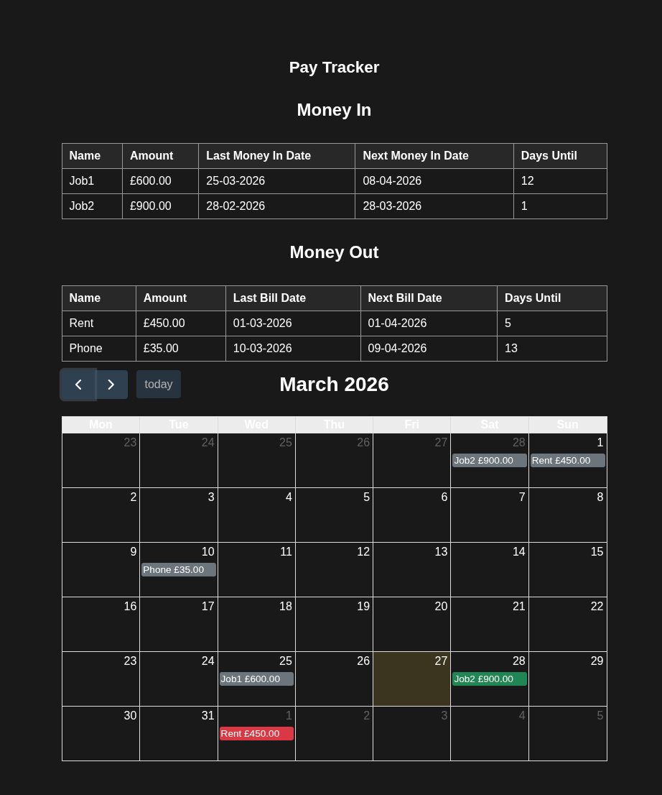

# Pay Tracker

Simple single-file HTML & JS static tracker for recurring income, recurring bills, and monthly budget allowances.

<p align="center">
  
</p>

## Data structure

### `money_in` and `recurring_bills`

Both are arrays of objects that describe **scheduled** income or expenses. Each entry uses this base shape:

```js
{
  name: "Label shown in table/calendar",
  amount: 600,
  baseDate: "27/03/24" // DD/MM/YY or DD/MM/YYYY
}
```

The recurrence type is inferred from which extra field is present:

- `periodDays` — fixed period recurrence
- `calendarDay` — monthly calendar-day recurrence

Exactly one of these fields must be present.

#### `periodDays` (fixed period)

Use this for events that repeat every _N_ days.

```js
periodDays: 14
```

Example:

```js
{ name: "Job1", amount: 600, baseDate: "27/03/24", periodDays: 14 }
```

#### `calendarDay` (calendar date)

Use this for events that repeat monthly on a calendar day.

```js
calendarDay: 28
```

Example:

```js
{ name: "Rent", amount: 450, baseDate: "01/03/24", calendarDay: 1 }
```

### `budgets`

A separate array for flexible monthly amounts (e.g. food, entertainment, hobbies). Entries are **not** scheduled: they only have a name and amount. They do **not** use `baseDate`, `calendarDay`, or `periodDays`, and they do **not** appear on the calendar.

```js
{
  name: "Food",
  amount: 300
}
```

## UI behaviour

- **Tables:** Money in, recurring bills (with last/next dates and days until), and budgets (name and amount only).
- **Calendar:** Shows only **money in** and **recurring bills** — budgets are excluded.
- **Monthly totals:** For the month shown on the calendar, totals include money in, recurring bills (from scheduled events in that month), budgets (sum of all budget lines, same every month), and a net total: money in minus recurring bills minus budgets.

## Where to edit

Update the arrays at the top of `index.html`:

- `money_in` — incoming money (scheduled)
- `recurring_bills` — recurring bills/expenses (scheduled)
- `budgets` — monthly budget lines (name and amount only)
